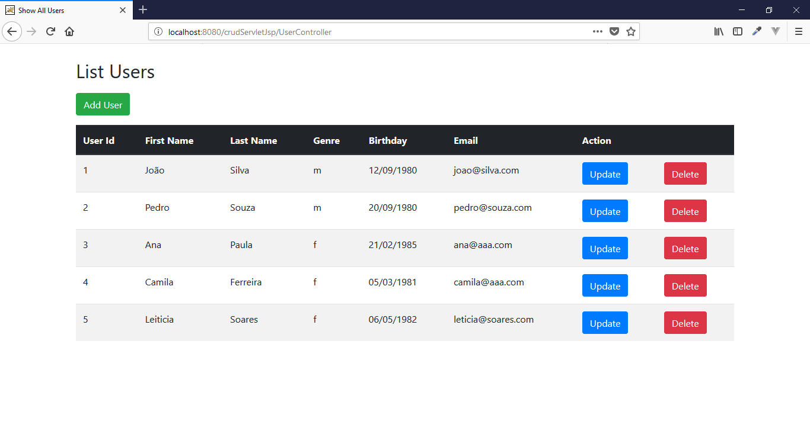
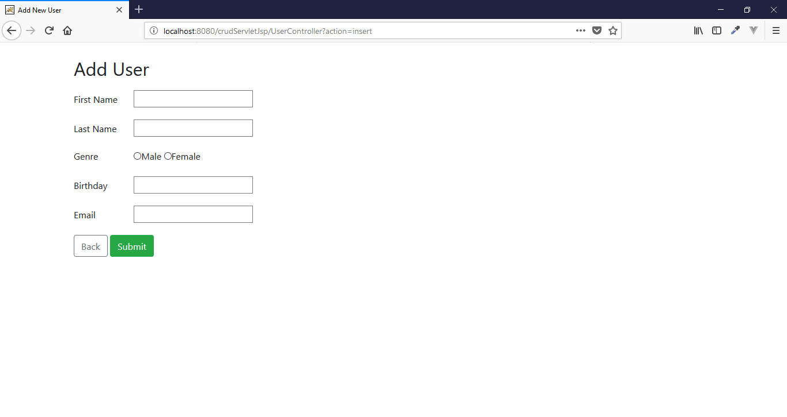
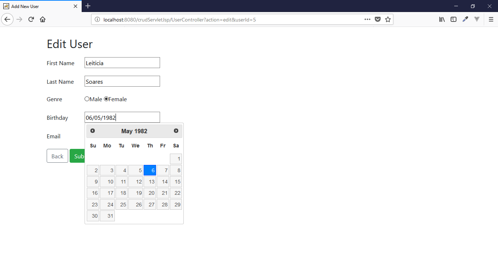
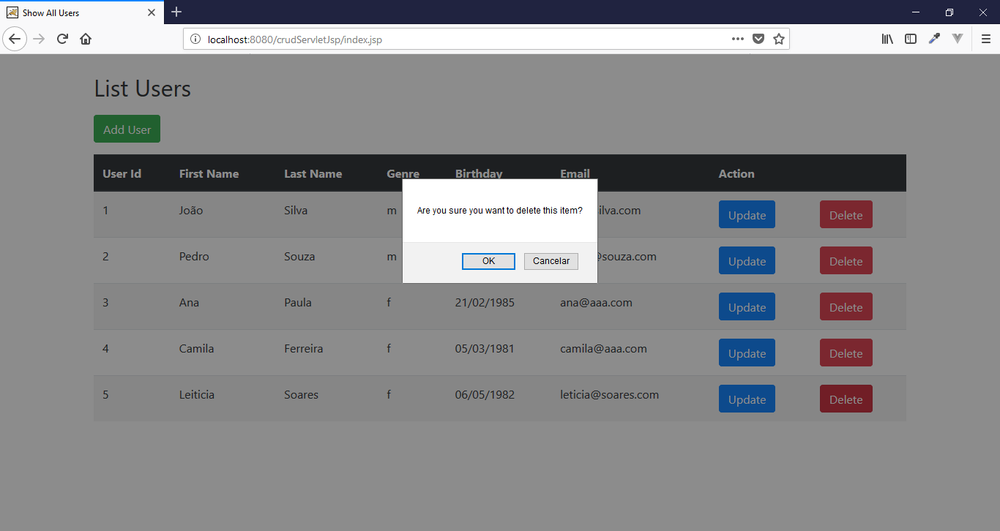

# User Registration

Simple user registration project using Java Servlet.

## Features

- CRUD
- MVC
- Servlet

## Requirements

- NetBeans 8.2
- Java JDK 1.8
- Apache Tomcat >= 9
- MySql >=5

## Tecnologies

- Java
- JSTL
- JSP
- CSS
- Jquery
- Bootstrap
- MySql

## Installation

```
$ git clone https://github.com/danilomeneghel/crudServletJsp.git

$ cd crudServletJsp

```

Then create a database with name crud_servlet_jsp in your mysql. You can find database dump in crud_servlet_jsp.sql, import it:

```
$ mysql -u <your user> -p <your password>

mysql> create database `crud_servlet_jsp`;

mysql> use `crud_servlet_jsp`;

mysql> source crud_servlet_jsp.sql

```

After you finish configuring, just open NetBeans and run the project in the browser. <br>

http://localhost:8080/crudServletJsp/UserController

## Licence

This project is licensed under <a href="LICENSE">The MIT License (MIT)</a>.

## Screenshots

<br><br>
<br><br>
<br><br>
<br><br>

<br><br>
Developed by<br>
Danilo Meneghel<br>
danilo.meneghel@gmail.com<br>
http://danilomeneghel.github.io/<br>

